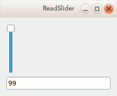

# PyQt basics tutorial

Here we demonstrate the tools provided by PyQt Python package for creating beautiful front end Graphical User Interfaces (GUIs). PyQt employs the Agile development philosophy of software development[^1] giving prime focus to
- responsive to change
- working software as a measure of progress.

[^1]: Refer to `whitepapers` subfolder

---

# What is this tutorial about?

This repository takes a step-by-step tour of creating a responsive PyQt5 app. We are following the [first tutorial on PyQt5][1] enlisted in [Tutorials section][2] of the [About PyQt Wiki][3]

Let us first understand the basics of PyQt;

- creating widgets
- laying out widgets
- creating signal and slots
- freezing your GUI apps
- creating installers for seamless deployment

To accomplish the above tasks, we need a working installation of PyQt.
Refer the [installation section](#pyqt-installation) below

[1]: https://build-system.fman.io/pyqt5-tutorial (first tutorial)
[2]: https://wiki.python.org/moin/PyQt/Tutorials (tutorials)
[3]: https://wiki.python.org/moin/PyQt (About wiki)

---

# PyQt: What is it?

- PyQt is a Python binding for Qt framwork. It provides wrappers for around 600 classes of Qt.
- let us focus on the User Interface. However PyQt provides wrappers  various other Qt tools like
requests handling, drawing, etc
- Qt employs a hierarchial object oriented framework where every object inherits from the QtObject;
base class
- User interface objects inherit from QWidget class, child of the QObject class
- Various objects like QLineEdit, QSlider, QComboBox, QGroup Box are there
- A widget can nest in another widget enabling a Matroshka style of interface

---

# PyQt4 or PyQt5

- Later the better philosophy
- Whats new in PyQt5? #TODO

---

# PyQt: Hello world -- Create a widget

Our GUI based "Hello world" app should be the starting point. Create a

    from PyQt5.QtWidgets import QApplication, QLabel
    app = QApplication([])          # instantiate a PyQt App. This is a requirement
    label = QLabel('Hello World!')  # create a label widget
    label.show()                    # show the widtget
    app.exec_()                     # hand over the control to the app

---

# PyQt: Creating a layout

This script demonstrates the layout features of PyQt.
Case under study is the  QVBoxLayout()

    from PyQt5.QtWidgets import QApplication, QWidget, QPushButton, QVBoxLayout
    #
    # Create the Application instance. This is a requirement.
    #
    app = QApplication([])
    #
    # Create the widgets required for the app
    #
    window = QWidget()      # create a window of type QWidget
    topButton       = QPushButton('Top')    # create push button Top
    bottomButton    = QPushButton('Bottom') # create push button Bottom
    #
    # Create the layout of the widgets using QVBoxLayout
    #
    layout = QVBoxLayout()                  # create the layout
    layout.addWidget(QPushButton('Top'))    # populate the layout with the created widgets
    layout.addWidget(QPushButton('Bottom')) # ...
    #
    # Set the above layout to the above window
    #
    window.setLayout(layout)                # set the layout for the window
    window.show()                           # draw the window
    app.exec_()                             # give control of the window to Qt till the user closes it!

---

# PyQt: Styling the interface

This scripts demonstrates the styling features of PyQt.
Case under study is setting the global app style, QPallette.

    from PyQt5.QtCore import Qt
    from PyQt5.QtGui import QPalette
    from PyQt5.QtWidgets import QApplication, QPushButton

    #
    # Set the global style using setStyle() method
    #
    app = QApplication([])
    app.setStyle('Fusion')
    #
    # use QPallete to deal with colors and apply changes globally to app's setPallete()
    #   
    palette = QPalette()
    palette.setColor(QPalette.ButtonText, Qt.red)
    app.setPalette(palette)
    #
    # Widgets creation
    #
    button = QPushButton('Hello World')
    #
    # Widget drawing
    #
    button.show()
    #
    # Widget control to Qt
    #
    app.exec_()

---

# PyQt: Creating signals and slots

This script demonsrates the core underlying principle
of Qt's user-app interaction - the signal - slot mechanism

Signal is any event generated by a Qt object
Slot is the event handler or the action to be performed for a particular signal. `connect()`     is the callback interface between a signal and a slot.

    from PyQt5.QtWidgets import QApplication, QPushButton, QMessageBox
    app = QApplication([])
    button = QPushButton('Click')   #This is a PushButton widget
    #
    # Define a slot which allows the signal to be slotted
    # (i.e what to do with the signal) when the signal is generated
    #
    def on_button_clicked():
        alert = QMessageBox()       # set a Message Window
        alert.setText('You clicked the button!')
        alert.exec_()               # hand over the control to the alert window

    #
    # create a signal to be generated by button widget and
    # calling the on_button_clicke() method as a slot
    #
    button.clicked.connect(on_button_clicked)
    #
    # show the button
    #
    button.show()
    app.exec_()

---

# ReadSlider: 0

My first PyQt app. In this tutorial, let us progressively build a PyQt App in which we read the state value (the slider Position) of a QWidget like Slider and write the state value to another QWidget like the QTextEdit.

Step 0: Create a slider object

    from PyQt5.QtCore import Qt
    from PyQt5.QtWidgets import QApplication, QSlider

    app = QApplication([])  # instantiate a Qt App
    #
    # create a Slider widget
    #
    mySlider = QSlider(Qt.Horizontal)
    mySlider.setValue(25)
    #
    # show the widget
    #
    mySlider.show()
    #
    # hand over the control to the Qt App
    #
    app.exec_()

---

# ReadSlider: 1

Step 1: I do not know how to get the state value of the slider.
Instead let me try it with QLineEdit. So create a pair of LineEdit in a
Vertical Box Layout

    from PyQt5.QtWidgets import QApplication, QWidget, QLineEdit, QVBoxLayout

    app = QApplication([])  # instantiate a Qt App
    #
    # create a QWidget container widget to hold the Slider and TextEdit boxes
    #
    myWindow = QWidget()
    #
    # create two lineEdit widgets
    #
    myLineEdit1 = QLineEdit()
    myLineEdit1.setText('Hello, world!')
    myLineEdit2 = QLineEdit()
    myLineEdit2.setText('Bye, world!')
    #
    # create the layout
    #
    layout = QVBoxLayout()          # create the layout
    layout.addWidget(myLineEdit1)      # populate the layout with the created widgets
    layout.addWidget(myLineEdit2)     # ...
    #
    # Set the above layout to the above window
    #
    myWindow.setLayout(layout)                # set the layout for the window
    myWindow.show()                           # draw the window
    #
    # hand over the control to the Qt App
    #
    app.exec_()

---

# ReadSlider: 2

Step 2: Slot one of the LineEdit's signal to the slot of other LineEdit
and vice versa

    from PyQt5.QtWidgets import QApplication, QWidget, QLineEdit, QVBoxLayout

    app = QApplication([])  # instantiate a Qt App
    #
    # create a QWidget container widget to hold the Slider and TextEdit boxes
    #
    myWindow = QWidget()
    #
    # create two lineEdit widgets
    #
    myLineEdit1 = QLineEdit()
    myLineEdit1.setText('Hello, world!')
    myLineEdit2 = QLineEdit()
    myLineEdit2.setText('Bye, world!')
    #
    # create the layout
    #
    layout = QVBoxLayout()          # create the layout
    layout.addWidget(myLineEdit1)      # populate the layout with the created widgets
    layout.addWidget(myLineEdit2)     # ...
    #
    # Set the above layout to the above window
    #
    myWindow.setLayout(layout)                # set the layout for the window
    myWindow.show()                           # draw the window
    #
    # Event handlers
    #
    def onReturnPressed1():
        textlisten = myLineEdit1.text()
        myLineEdit2.setText(textlisten)
    def onReturnPressed2():
        textlisten = myLineEdit2.text()
        myLineEdit1.setText(textlisten)
    #
    # Signals
    #
    myLineEdit1.returnPressed.connect(onReturnPressed1)
    myLineEdit2.returnPressed.connect(onReturnPressed2)
    #
    # hand over the control to the Qt App
    #
    app.exec_()

---

# ReadSlider: 3

Step 3: Read the LineEdit value and print to standard output

    from PyQt5.QtWidgets import QApplication, QLineEdit

    app = QApplication([])  # instantiate a Qt App
    #
    # create a Slider widget
    #
    myLineEdit = QLineEdit()
    myLineEdit.setText("Hello, world!")
    #
    # show the widget
    #
    myLineEdit.show()
    #
    # Event handler
    #
    def onReturnPressed():
        '''Print the text to stdout in the lineEdit widget on pressing return'''
        textlisten = myLineEdit.text()
        print(textlisten)
    #
    # Signal
    #
    myLineEdit.returnPressed.connect(onReturnPressed)
    #
    # hand over the control to the Qt App
    #
    app.exec_()

---

# ReadSlider: 4

Step 4: Finally ! Create the Slider and LineEdit widgets.
Read the slider value and writer to the line Edit widget.

    from PyQt5.QtWidgets import QApplication, QWidget, QSlider, QLineEdit, QVBoxLayout

    app = QApplication([])  # instantiate a Qt App
    #
    # create a QWidget container widget to hold the Slider and TextEdit boxes
    #
    myWindow = QWidget()
    #
    # create a Slider widget
    #
    mySlider = QSlider()
    mySlider.setValue(25)
    #
    # create a lineEdit widget
    myLineEdit = QLineEdit()
    myLineEdit.setText('Hello, world!')
    #
    # create the layout
    #
    layout = QVBoxLayout()          # create the layout
    layout.addWidget(mySlider)      # populate the layout with the created widgets
    layout.addWidget(myLineEdit)     # ...
    #
    # Set the above layout to the above window
    #
    myWindow.setLayout(layout)                # set the layout for the window
    myWindow.show()                           # draw the window
    #
    # Event handlers
    #
    def onSliderReleased():
        positionListen = mySlider.sliderPosition()
        myLineEdit.setText(str(positionListen))
    #
    # Signal
    #
    mySlider.sliderReleased.connect(onSliderReleased)
    #
    # hand over the control to the Qt App
    #
    app.exec_()

---

# ReadSlider: Freeze the app

In Pythonic world, freezing is creating self-contained executable (packaging) from source code. This involves compiling, linking, including and building binaries. There are various libraries to handle freezing like py2exe, py2app. Freezing PyQt apps is a hard problem. [fbs][4] (fman's  build system) helps in freezing PyQt GUI apps.   [fman][5] is the next generation cross platform file manager for programmers.

`fbs` creates a wrapper around our app and structures the source code suited for packaging and generating executables. For this we need to start a fbs project using

    fbs startproject

The apps source code needs to be edited to conform to the fbs wrapping feature as in src/main subfolder

    from fbs_runtime.application_context.PyQt5 import ApplicationContext
    from PyQt5.QtWidgets import QWidget, QSlider, QLineEdit, QVBoxLayout

    import sys

    if __name__ == '__main__':
        appctxt = ApplicationContext()       # 1. Instantiate ApplicationContext
        #
        # create a QWidget container widget to hold the Slider and TextEdit boxes
        #
        myWindow = QWidget()
        #
        # create a Slider widget
        #
        mySlider = QSlider()
        mySlider.setValue(25)
        #
        # create a lineEdit widget
        myLineEdit = QLineEdit()
        myLineEdit.setText('Hello, world!')
        #
        # create the layout
        #
        layout = QVBoxLayout()          # create the layout
        layout.addWidget(mySlider)      # populate the layout with the created widgets
        layout.addWidget(myLineEdit)     # ...
        #
        # Set the above layout to the above window
        #
        myWindow.setLayout(layout)                # set the layout for the window
        myWindow.show()                           # draw the window
        #
        # Event handlers
        #
        def onSliderReleased():
            positionListen = mySlider.sliderPosition()
            myLineEdit.setText(str(positionListen))
        #
        # Signal
        #
        mySlider.sliderReleased.connect(onSliderReleased)
        #
        # hand over the control to the Qt App
        #
        exit_code = appctxt.app.exec_()      # 2. Invoke appctxt.app.exec_()
        sys.exit(exit_code)

Now the app can be tested and developed using

    fbs run

If we are satisfied with the app, we can freeze the app to create a self contained directory of executable for the app and its associated dependencies using

    fbs freeze

[4]: https://github.com/mherrmann/fbs
[5]: https://github.com/fman-users/fman

add image of the running app window  #TODO  

---

# ReadSlider: Create installer

    fbs installer

An installer helps to create a mechanism to copy/update the required fiels (binary and/or source) at appropriate locations in the file system, write registry keys, write configuration files, create shortcuts, icons.

Setting up the PyQt GUI App Installer is a tricky business. Fortunaely fbs handles it well. However it has some dependencies depending on the OS. This [fbs tutorial][6] has given proper instructions on setting up a working fbs.

For the Linux OS, `fbs` uses the `fpm`, the Effing package management tool that builds packages for multiple platforms like .deb, .rpm, etc. For the Windows OS, `fbs` uses [NSIS][7] Nullsoft's Scriptable Install System for package building.

add image of the .deb package #TODO

[6]: https://github.com/mherrmann/fbs-tutorial#creating-an-installer
[7]: https://sourceforge.net/projects/nsis/

---

# PyQt Installation

As with any Python package installation, it is recommended to work virtual environments. Depending on the OS, the dependencies for PyQt installation are different. Let us focus on the PyQt5 version.

## Linux installation

Installing a virtual environments (#TODO)

Installing a specific Python version (#TODO)
